# cmos_vref — default

**Variation ID:** `cmos_vref-default-d813dd`  
**Exported:** 2026-09-02T15:24:42

CMOS vref generator that compensates the FET VTH CTAT behaviour with a PTAT current generated with a self biased voltage following current mirror.

**References:**
- OLIVEIRA, Arthur Campos de. Temperature compensated subthreshold CMOS voltage references for ultra low power applications. 2017.
- CAMACHO-GALEANO, Edgar Mauricio; GALUP-MONTORO, Carlos; SCHNEIDER, Márcio Cherem. A 2-nW 1.1-V self-biased current reference in CMOS technology. IEEE Transactions on Circuits and Systems II: Express Briefs, v. 52, n. 2, p. 61-65, 2005.

## Schematic

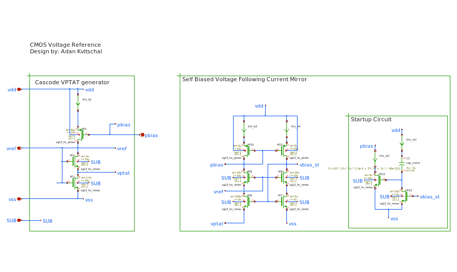

## Parameters

| Parameter | Value | Description |
|---|---|---|
| m1_length | 20u | Channel Length of the lower cascode vptat generator transistor |
| m1_width | 2.5u | Channel Width of the lower cascode vptat generator transistor |
| m2_length | 10u | Channel Length of the upper cascode vptat generator transistor |
| m2_width | 2u | Channel Width of the upper cascode vptat generator transistor |
| pbias_length | 10u | Channel Length of the PMOS bias transistors |
| m3_width | 50u | Channel Width of the bias transistor on the vptat generator branch |
| m6m7_length | 2u | Channel Length of the M6/M7 nmos current mirror pair in the self-biased voltage following current mirror (sbvfcm) |
| m6m7_width_base | 5u | Shared unit-cell channel width for the M6/M7 nmos current-mirror pair (sbvfcm) -- actual per-leg width is this * the leg's own integer factor (m6_factor/m7_factor), computed in Python before schematic substitution (never a formula in the netlist). See this file's derived_parameters.width_groups. |
| m6_factor | 20 | Integer multiple of m6m7_width_base giving M6's actual channel width (diode-connected mirror leg) -- also the intended unit-cell count for future common-centroid layout. |
| m7_factor | 1 | Integer multiple of m6m7_width_base giving M7's actual channel width (mirrored leg) -- together with m6_factor this sets the sbvfcm's current-mirror ratio, a real circuit design freedom, not just a matching artifact. |
| m8m9_length | 10u | Channel Length of the M8/M9 nmos cascode pair stacked above M6/M7 in the sbvfcm |
| m8m9_width_base | 10u | Shared unit-cell channel width for the M8/M9 nmos cascode pair stacked above M6/M7 -- actual per-leg width is this * the leg's own integer factor (m8_factor/m9_factor). See this file's derived_parameters.width_groups. |
| m8_factor | 1 | Integer multiple of m8m9_width_base giving M8's actual channel width. Locked to 1 for now (min=max=1) -- preserves today's exact M8=M9 invariant; widen only as a deliberate later decision once a reason to ratio the cascodes differently is identified. |
| m9_factor | 1 | Integer multiple of m8m9_width_base giving M9's actual channel width. Locked to 1 for now, see m8_factor. |
| m10_width | 5u | Channel Width of transistor M10 (pmos current mirror transistor biasing the sbvfcm) |
| m11_width | 5u | Channel Width of transistor M11 (pmos current mirror transistor biasing the sbvfcm) |
| m12_length | 10u | Channel Length of transistor M12 (startup circuit transistor) |
| m12_width | 5u | Channel Width of transistor M12 (startup circuit transistor) |
| m13_length | 5u | Channel Length of transistor M13 (startup circuit transistor) |
| m13_width | 10u | Channel Width of transistor M13 (startup circuit transistor) |
| startup_cap_side | 7u | Side length of the square MiM startup capacitor C1 (w=l=side) |
| startup_cap_mult | 10 | Instance multiplier (m=) of the startup capacitor C1 |
| m6_width (ƒx) | 100u | M6/M7 nmos current-mirror pair -- shares symmetry.islands' id on purpose so a future layout-generation pass can cross-reference this group's unit width/factors with that island's mirrored placement by the same key. |
| m7_width (ƒx) | 5u | M6/M7 nmos current-mirror pair -- shares symmetry.islands' id on purpose so a future layout-generation pass can cross-reference this group's unit width/factors with that island's mirrored placement by the same key. |
| m8_width (ƒx) | 10u | M8/M9 nmos cascode pair stacked above M6/M7. No symmetry.islands entry exists yet for this pair -- this id is a reservation for when one is added. |
| m9_width (ƒx) | 10u | M8/M9 nmos cascode pair stacked above M6/M7. No symmetry.islands entry exists yet for this pair -- this id is a reservation for when one is added. |

## Design profile

Matched profile: **low_power** (7/7 constraints) — FOM: 1.29M

| Profile | Score | FOM | Description |
|---|---|---|---|
| low_power | 7/7 | 1.29M | Notably lower current consumption than the spec requires |
| high_performance | 5/7 | 1.52K | Meets temperature coefficient, line/load regulation, startup, and PSRR specs simultaneously |

## Test results

| Test | Metric | Typical | Min | Max | Mean | Std | Unit | Spec | Pass |
|---|---|---|---|---|---|---|---|---|---|
| area | Estimated layout area | 4175 | 4175 | 4175 |  |  | µm² |  | PASS |
| current_consumption | Vref core current consumption | 0.1704 | 0.1027 | 0.2589 |  |  | uA |  | PASS |
| line_reg | Line regulation | 0.01001 | 0.008301 | 0.01679 |  |  | % |  | PASS |
| load_reg | Load regulation | 0.2599 | 0.2426 | 0.3301 |  |  | % |  | PASS |
| noise | Output-referred noise | 7.91 | 7.34 | 8.501 |  |  | nV/sqrt(Hz) | ≤ 7 nV/sqrt(Hz) |  |
| psrr | PSRR @ 1kHz | 58.01 | 57.52 | 58.51 |  |  | dB |  | PASS |
| reference_current | Core reference current (M3 branch) | 142 | 85.5 | 215.9 |  |  | nA |  |  |
| startup | Startup overshoot | 128 | 116 | 141.7 |  |  | % |  |  |
| startup | Startup settling time | 10.36 | 9.705 | 10.82 |  |  | us |  | PASS |
| startup | Vref peak voltage | 1.777 | 1.768 | 1.779 |  |  | V |  |  |
| temp_sweep | Temperature coefficient (commercial 0-70C) | 59.35 | 55.62 | 62.85 |  |  | ppm/°C |  | PASS |
| temp_sweep | Temperature coefficient (full -40-125C) | 102.9 | 99.98 | 104.4 |  |  | ppm/°C |  |  |
| temp_sweep | Temperature coefficient (industrial -40-85C) | 55.24 | 55.24 | 60.68 |  |  | ppm/°C |  |  |
| temp_sweep | Vref output voltage | 0.7796 | 0.7222 | 0.8229 |  |  | V |  |  |
| vref_mismatch | Core reference current (M3 branch) (mismatch) |  | 123.7 | 170.8 | 144.2 | 9.138 | nA |  |  |
| vref_mismatch | Vref output voltage (mismatch) |  | 0.7648 | 0.8029 | 0.7814 | 0.007605 | V |  |  |
| vref_stat | Core reference current (M3 branch) (stat) |  | 137.7 | 147.7 | 141.8 | 2.2 | nA |  |  |
| vref_stat | Vref output voltage (stat) |  | 0.7386 | 0.8048 | 0.7814 | 0.01489 | V |  |  |

## Plots

### current_consumption — plot

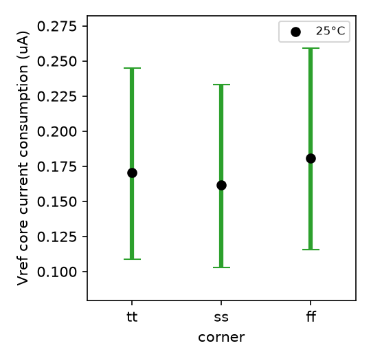

### line_reg — All

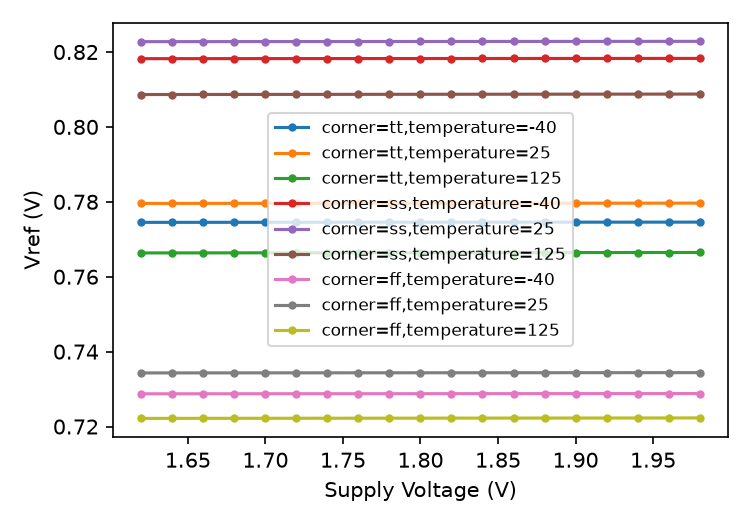

### line_reg — Typical

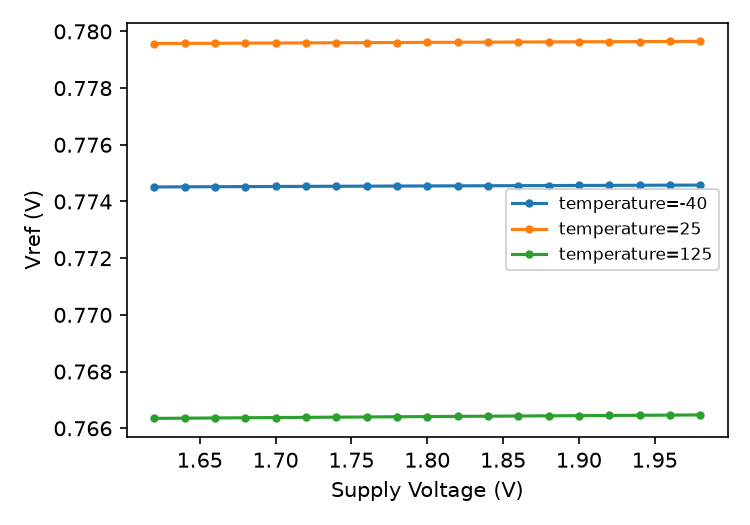

### line_reg — Worst

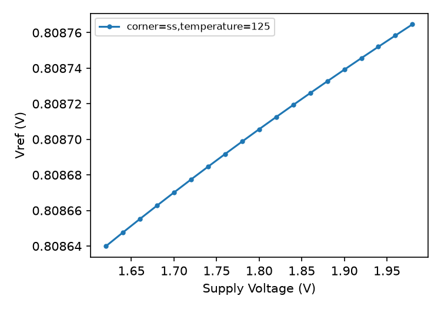

### load_reg — All

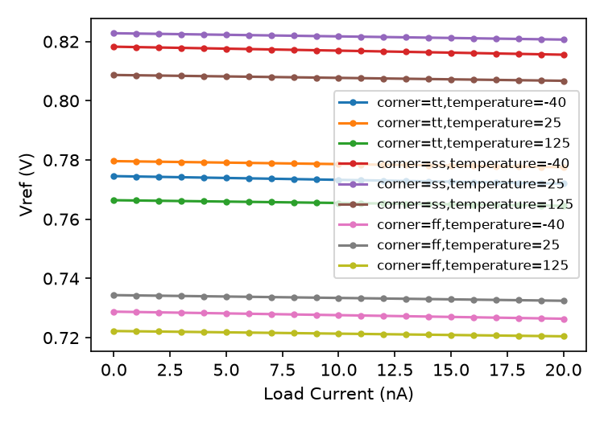

### load_reg — Typical

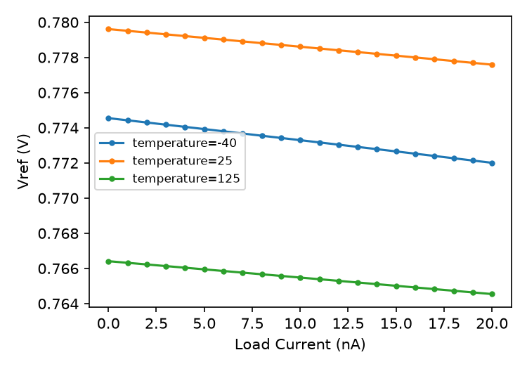

### load_reg — Worst

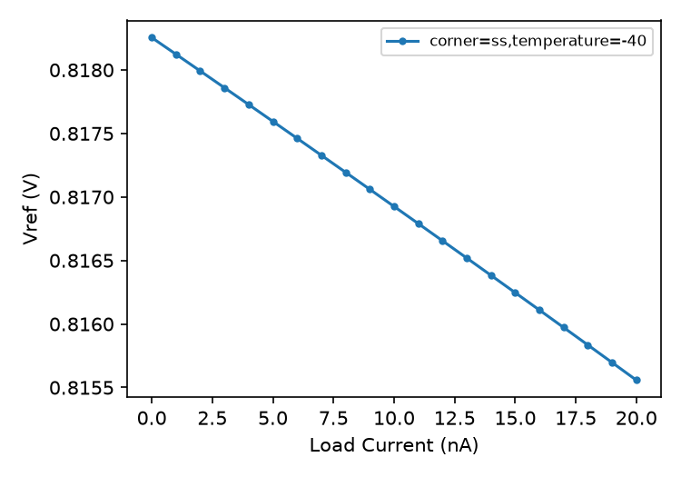

### noise — plot

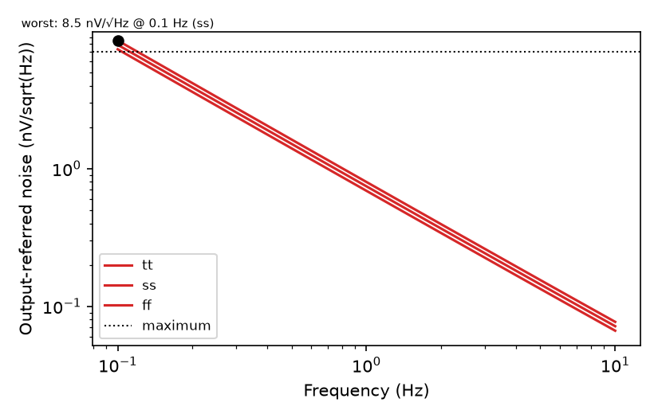

### psrr — plot

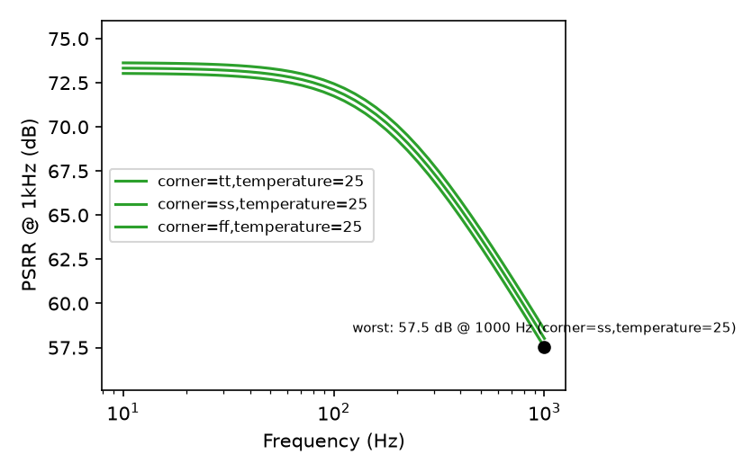

### reference_current — plot

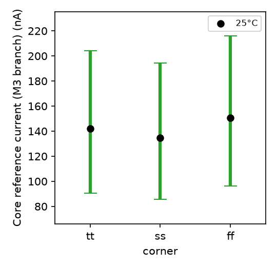

### startup — plot

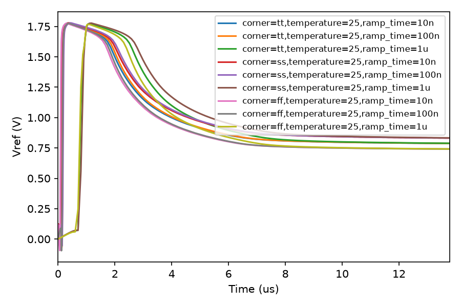

### temp_sweep — All

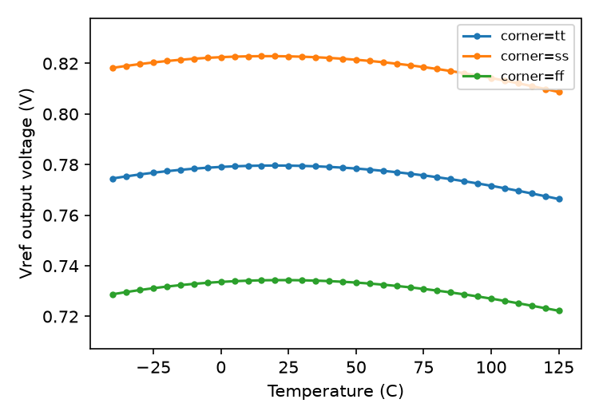

### temp_sweep — Typical

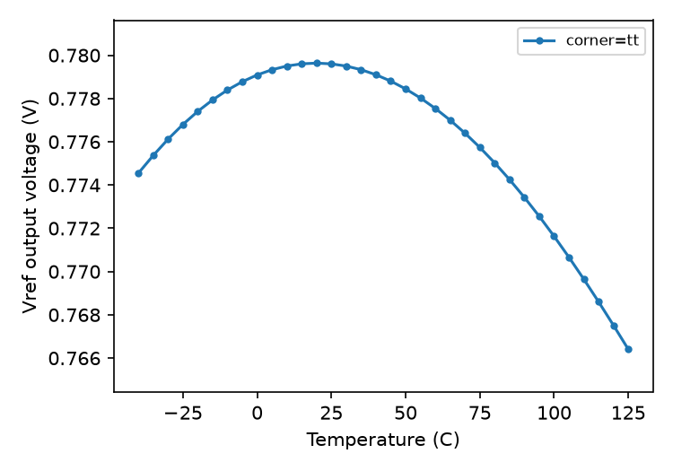

### temp_sweep — Worst

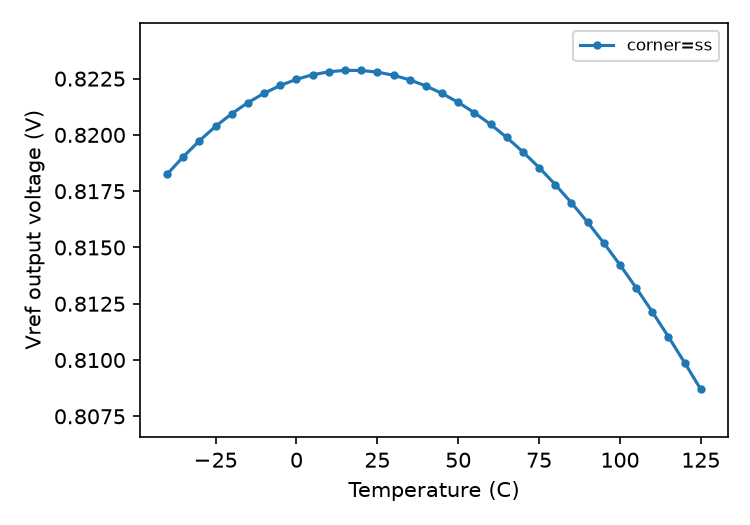

### vref_mismatch — Reference Current

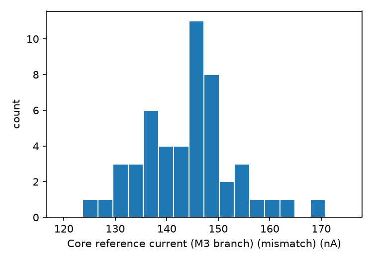

### vref_mismatch — Vref

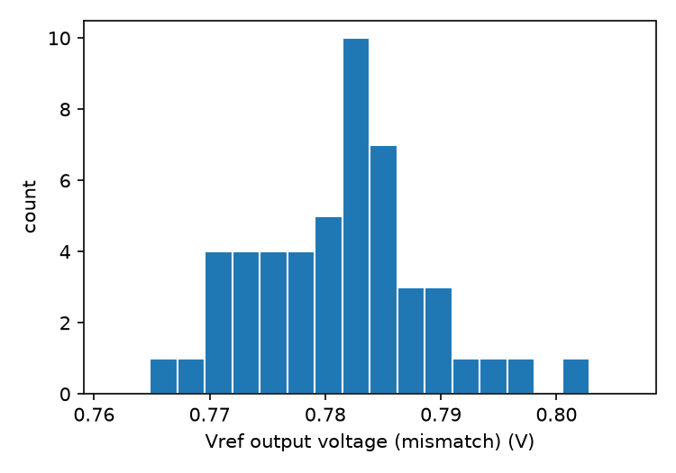

### vref_stat — Reference Current

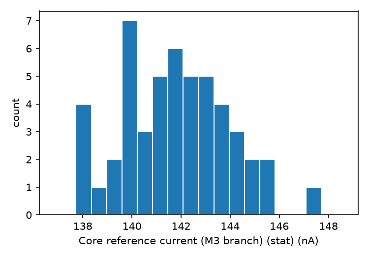

### vref_stat — Vref

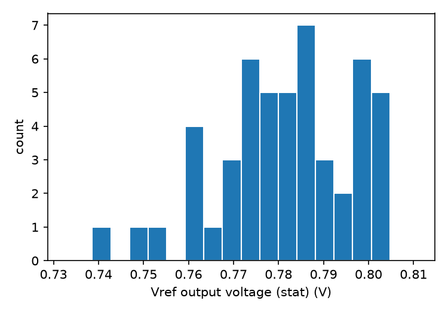
