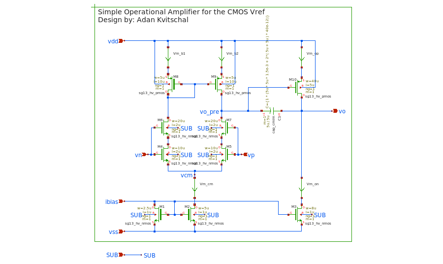
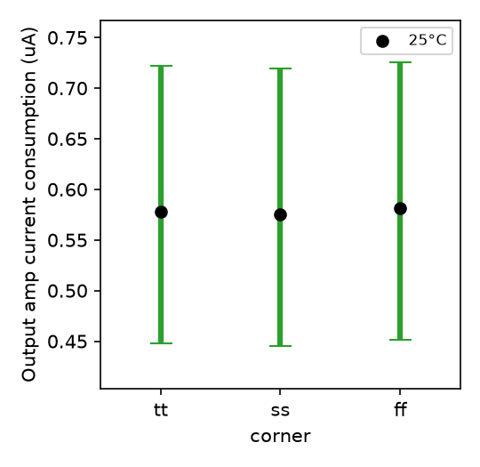
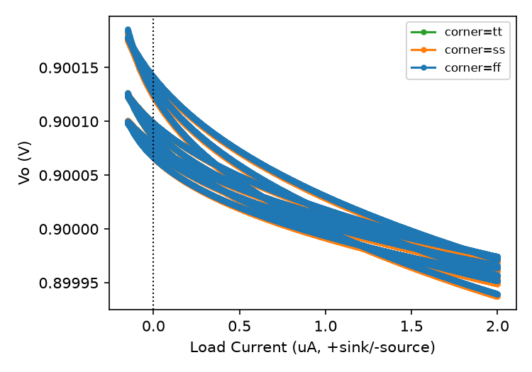
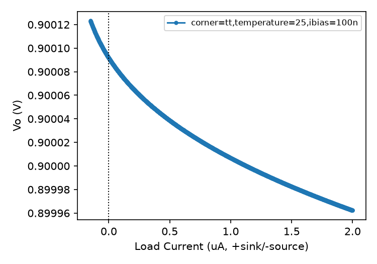
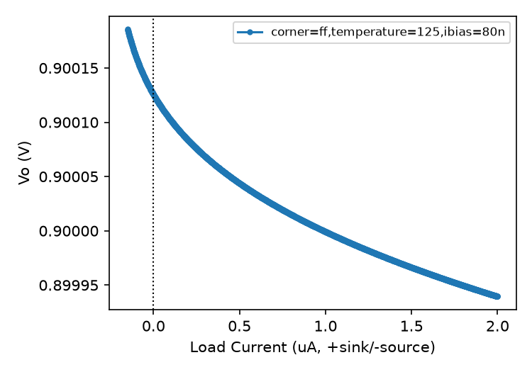
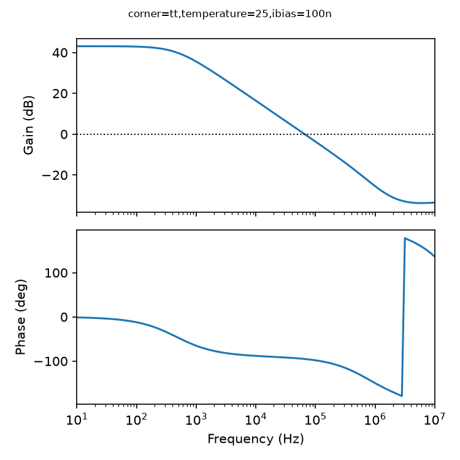
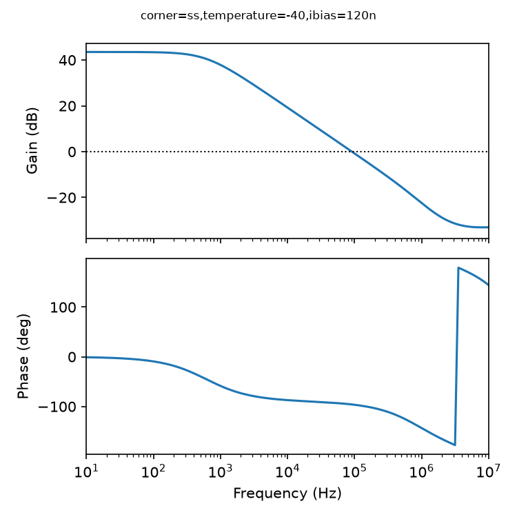
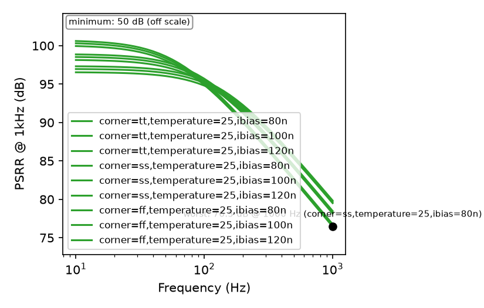

# output_amp — default

**Variation ID:** `output_amp-default-6a5d00`  
**Exported:** 2026-09-02T15:24:42

Two-stage Miller-compensated CMOS op-amp: NMOS differential pair with cascode stack and active PMOS mirror load, common-source PMOS output driver. Used as a unity-feedback DC buffer for cmos_vref.

## Schematic

## Parameters

| Parameter | Value | Description |
|---|---|---|
| nbias_length | 1u | Channel length shared by M1/M2/M3 (ibias mirror legs: diode reference, diffpair tail, output pull-down bias) |
| m1_width | 2.5u | Channel width of M1 (diode-connected reference of the ibias mirror) |
| m2_width | 5u | Channel width of M2 (tail current source of the differential pair) |
| m3_width | 8u | Channel width of M3 (output stage pull-down current source) |
| m4m5_length | 2u | Channel length of M4/M5 (differential pair input transistors) |
| m4m5_width | 10u | Channel width of M4/M5 (differential pair input transistors) |
| m6m7_length | 2u | Channel length of M6/M7 (cascode stack above M4/M5, gate tied to the same vn/vp net as the paired input transistor) |
| m6m7_width | 20u | Channel width of M6/M7 (cascode stack above M4/M5) |
| m8m9_length | 10u | Channel length of M8/M9 (first-stage active PMOS current-mirror load) |
| m8m9_width | 5u | Channel width of M8/M9 (first-stage active PMOS current-mirror load) |
| m10_length | 5u | Channel length of M10 (second-stage common-source PMOS pull-up driver, gate=vo_pre, drain=vo) |
| m10_width | 40u | Channel width of M10 (second-stage common-source PMOS pull-up driver) |
| millercap_side | 5u | Side length of the square MiM Miller compensation capacitor C1 (w=l=side), bridging vo_pre and vo |
| millercap_mult | 1 | Instance multiplier (m=) of the Miller compensation capacitor C1 |

## Design profile

Matched profile: **low_power** (6/6 constraints) — FOM: 343M

| Profile | Score | FOM | Description |
|---|---|---|---|
| low_power | 6/6 | 343M | Notably lower current consumption and area than the spec requires, while keeping gain/phase margin/PSRR/load regulation within acceptable bounds |

## Test results

| Test | Metric | Typical | Min | Max | Mean | Std | Unit | Spec | Pass |
|---|---|---|---|---|---|---|---|---|---|
| area | Estimated layout area | 1151 | 1151 | 1151 |  |  | µm² |  | PASS |
| current_consumption | Output amp current consumption | 0.5782 | 0.4449 | 0.7252 |  |  | uA |  | PASS |
| load_reg | Load regulation | 0.01788 | 0.01398 | 0.02734 |  |  | % |  | PASS |
| openloop_ac | Open-loop DC gain | 43.06 | 41.22 | 44.47 |  |  | dB |  | PASS |
| openloop_ac | Phase margin | 84.81 | 84.06 | 85.6 |  |  | deg | ≥ 45 deg | PASS |
| openloop_ac | Unity-gain bandwidth | 65.98 | 43.25 | 91.44 |  |  | kHz |  |  |
| psrr | PSRR @ 1kHz | 78.32 | 76.46 | 79.85 |  |  | dB | ≥ 50 dB | PASS |

## Plots

### current_consumption — plot

### load_reg — All

### load_reg — Typical

### load_reg — Worst

### openloop_ac — Typical

### openloop_ac — Worst Case

### psrr — plot

