# top — default

**Variation ID:** `top-default-8d8c0c`  
**Exported:** 2026-09-02T15:24:41

Vref core + output buffer amp integration: cmos_vref (X1) generates vref/pbias/vbg*, output_amp (x2) buffers it, plus a PMOS bias mirror (M1, sized off cmos_vref's own M3), an enable switch (M2), and trim resistors/switches (R1-R8/M6-M9).

**Sub-block dependencies:** X1 (cmos_vref): `cmos_vref-default-d813dd`, x2 (output_amp): `output_amp-default-6a5d00` — their materialized schematics (and, for a real registered variation, their own release/doc/ page) are kept in sync with these exact choices every time this block is exported.

## Schematic

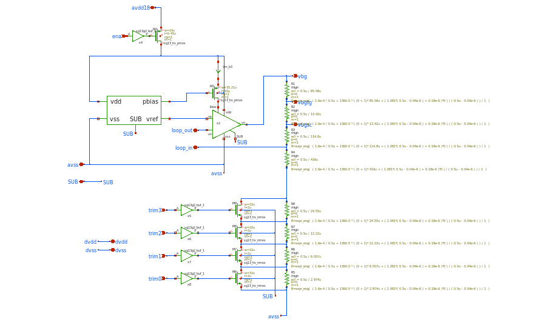

## Parameters

| Parameter | Value | Description |
|---|---|---|
| X1_variation | cmos_vref-default-d813dd | Which cmos_vref/default variation composes X1 in this top variation -- a real registered variation name, or the reserved value "defaults" (cmos_vref/default's own config.json defaults, no variation needs to be registered first). |
| x2_variation | output_amp-default-6a5d00 | Which output_amp/default variation composes x2 in this top variation -- same convention as X1_variation. |
| ena_length | 0.45u | Channel Length of M2 (PMOS enable switch, avdd18 -> the vref core's own supply). The sky130_ak_ip__cmos_vref sibling project's equivalent (M20) uses L=0.3u, but that's below this PDK's own sg13_hv_pmos minimum (see cmos_vref's own pbias_length/m2_length, both min=0.40-0.45u) -- clamped up to 0.45u, the smallest value actually valid for this device on this PDK. |
| ena_width | 10u | Channel Width of M2 (PMOS enable switch). Matches the sky130_ak_ip__cmos_vref sibling project's equivalent (M20, W=10u). |
| trim_switch_length | 2u | Channel Length of the M6-M9 trim network switches (NMOS, gate driven by trim0-trim3 via a sg13g2_buf_1 buffer). Matches the sky130_ak_ip__cmos_vref sibling project's equivalent (trim_res.sch's M1-M4, L=2u). |
| trim_switch_width | 10u | Channel Width of the M6-M9 trim network switches. Matches the sky130_ak_ip__cmos_vref sibling project's equivalent (trim_res.sch's M1-M4, W=10u). |
| base_width | 0.5u | Shared width of R1-R8 (the vbg/vbgtg/vbgsc feedback divider + its R5-R8 binary trim network, sch/top/top_default.sch). IHP's sg13g2 rhigh model doesn't document a fixed/DRC-mandated width the way sg13_hv_pmos/nmos do for length (see ena_length's own note) -- this is exposed as a free parameter rather than pinned, so if a real width-fixing design rule turns up later this can be clamped to it (min=max) without touching the resistor formulas themselves, which only ever reference 'base_width' symbolically. |
| rfeedback_total | 2Meg | Target sum of the whole R1..R8 series chain (vbg down to avss) -- the feedback network's total impedance around output_amp. Every resistor's length is a fixed or vref-dependent FRACTION of this single knob (see rbot_nominal below and the l= expressions in sch/top/top_default.sch), so raising it lowers the network's loading current 1:1 without touching the vbg/vbgtg/vbgsc voltage ratios. min=1Meg is a current-limit floor, not an arbitrary round number: output_amp's own config.json exposes no verified max-drive-current spec for its output stage (M10, a common-source PMOS driver biased at ~100nA quiescent -- the 80-120nA bias_matched profile constraint is that stage's OWN quiescent bias, not its large-signal drive capability), so 1.2uA was picked as a conservative, unverified placeholder for the most current the stage can source into this network before its output sags enough to miss vbg's 1200mV target -- in the same spirit as amp_bias_width's own flagged KNOWN LIMITATION, not a datasheet number. min=1Meg is exactly vbg_target/that placeholder (1.2V/1.2uA): lowering this min without re-deriving it from a real drive-current spec would silently let rfeedback_total draw more current than the amp is assumed able to source. |
| trim_factor | 0.1 | Fraction of rbot_full (see derived_parameters.formulas below) given to the removable R5-R8 binary trim network (weights 1:2:4:8, matching M6-M9/trim0-3) instead of to the fixed floor R4. trim_factor=0 collapses R5-R8 to 0 ohm each (M6-M9 switching becomes a no-op, Rbot is permanently R4=rbot_full); trim_factor=1 collapses R4 to 0 ohm (every bit of Rbot is removable, down to a 0-ohm floor with all of trim0-3 asserted). All 4 switches open (trim0-3='0', code 0) always gives Rbot=rbot_full regardless of trim_factor, since R4+R5+R6+R7+R8 = rbot_full*((1-trim_factor)+trim_factor) by construction; the CENTER of the 16-code range (code 7.5) gives Rbot=rbot_full*(1-trim_factor/2) = rbot_nominal (see rbot_nominal/rbot_full's own descriptions -- this is what fits the X1-typical design point to the MIDDLE of the trim range instead of to code 0, so trim can correct vbg in BOTH directions from that middle point, not just up from code 0). Bumped 0.1 -> 0.3 after tb/top's own trim_range test (16-code vbg sweep vs. corner/temperature) showed 0.1's total swing (~29mV @ typical) couldn't cover the 'ff' corner's ~80-90mV deficit from 1200mV even with the full 16 codes -- re-verify against trim_range before trusting any further change here. rfeedback_total puts a ceiling on how high this can go without a negative-length R3 (see r3_length's own formula: 0.8533333*rfeedback_total must stay above rbot_full, which grows as trim_factor -> 1) -- at the current rfeedback_total=2Meg/rbot_nominal defaults that ceiling is roughly trim_factor<0.44; raise rfeedback_total's own max (currently 10Meg) first if more range is ever needed than that allows. |
| amp_bias_width (ƒx) | 35.21u | M1's mirrored bias width, calculated (not free) -- scaled from cmos_vref's own m3_width so that M1's mirrored current (M1 and M3 share gate 'pbias', length 'pbias_length', and source rail -- a matched current mirror) is INTENDED to land on output_amp's 100nA design point, REGARDLESS of what m3_width the optimizer picks for cmos_vref's own, unrelated specs (Vref accuracy/TC/consumption) and regardless of which cmos_vref variation X1_variation selects. Replaces an earlier free 'amp_bias_factor' parameter (integer, 1-10) that could only scale the mirrored current UP relative to cmos_vref's own core current, never down. KNOWN LIMITATION (measured, not fixed): this is a single-shot, open-loop estimate -- cmos_vref's reference_current test measures M3 on a clean, directly-set 1.8V supply, but inside `top` the same core is fed through the M2 enable-switch PMOS, which drops tens of mV; combined with this mirror apparently running in weak/moderate inversion (VSG close to Vth), that supply difference alone was observed to cause a ~3x mismatch between the calculated target and the actual delivered current at the default parameter set (see tb/top's own amp_bias_current test, which measures the real thing and is expected to fail until this is revisited -- e.g. by hand-tuning `target` below against that test's own result, or by improving the calibration environment). Treat this as a best-effort starting point, not a guarantee. |
| pbias_length (ƒx) | 10u | X1.pbias_length |
| rbot_nominal (ƒx) | 1.299Meg | The Rbot (R4+R5..R8-effective) value that lands vbg on exactly 1200mV for X1's own actual measured typical vref DC output -- NOT the code-0 (all switches open) Rbot value anymore (that's rbot_full, derived_parameters.formulas below, which is what R4..R8's OWN lengths are actually sized from). Originally this WAS the code-0 Rbot directly, but tb/top's own trim_range test (16-code vbg sweep vs. corner/temperature) showed that scheme has no code that can lower vbg for any corner whose own untrimmed (code-0) vbg already reads above 1200mV, since the R5-R8/M6-M9 network only ever SHORTS resistance out of Rbot from its code-0 maximum -- trim could only ever push vbg UP from a code-0 baseline, never down. Recentering this value onto the MIDDLE of the 16-code range (code 7.5) instead -- rbot_full inflates it back up to what code 0 needs to be for that -- gives half the trim codes downward headroom (for corners like 'ff', which read below 1200mV untrimmed) and half upward (for corners like 'ss', which read above). Still computed exactly as before (rfeedback_total * X1's own measured typical vref / 1.2V, 'invert': true since it must grow WITH the measured vref) -- only what this value now REPRESENTS changed, not how it's calculated. Uses scale_to_target's 'stat': 'typical' (tt corner, sample closest to 25C -- see tb/cmos_vref/tb_vref_temp_sweep.py's evaluate() and tb/_shared/parser_common.typical_min_max()) rather than 'min'/'max', which are a range across the WHOLE temperature/corner sweep, not a single design-point reading -- sizing off either extreme would size the divider for a corner X1 isn't even necessarily run at. R1/R2 (the fixed 'de cima' resistors) are pure arithmetic on rfeedback_total/base_width; R3/R4..R8 additionally depend on rbot_full, not directly on this value -- see derived_parameters.formulas below (r1_length..r8_length, rbot_full) -- the 1200/1048/1024mV targets themselves are fixed circuit constants baked into those formulas (0.1266667, 0.02, 0.8533333 = (1200-1048)/1200, (1048-1024)/1200, 1024/1200), not free parameters. |
| rbot_full (ƒx) | 1.367e+06 | R4+R5+R6+R7+R8 combined AT trim0-3='0' (code 0, all switches open, the network's maximum Rbot) -- inflated from rbot_nominal (which now names the Rbot value at the CENTER of the 16-code range, code 7.5, not code 0 like before) by 1/(1-trim_factor/2): Rbot(code) is linear in code from Rbot_full at code=0 down to Rbot_full*(1-trim_factor) at code=15 (see r4_length..r8_length below), so Rbot(7.5) = rbot_full*(1-trim_factor/2) -- setting that equal to rbot_nominal and solving for rbot_full gives this expr. Exists because tb/top's own trim_range test (16-code vbg sweep across corner/temperature) showed the OLD scheme -- rbot_nominal literally AT code 0 -- has no code that can lower vbg for any corner whose own untrimmed vbg already reads above 1200mV (every 'ss' corner/temperature point measured): the R5-R8/M6-M9 network only ever SHORTS resistance out (Rbot can only shrink from code 0), so a code-0 baseline can only trim vbg UP, never down. Centering the nominal (X1-typical) fit on the MIDDLE code instead gives half the code range downward headroom (below-target corners, e.g. 'ff') and half upward (above-target corners, e.g. 'ss') -- trim_factor still needs to be large enough that half of the resulting swing covers each side's actual deficit (checked empirically via trim_range, not derivable in closed form from this formula alone: the amp's real non-inverting gain is vbg = vref_core*(1 + Rtop/Rbot(code)), not the simpler vbg=vref_core*rfeedback_total/Rbot this project's own r3_length/r4_length comments describe -- that simpler form only holds exactly AT whichever code Rtop+Rbot(code) equals rfeedback_total, i.e. only at code 0 in the OLD scheme, at the recentered code 7.5 here). |
| r1_length (ƒx) | 85.58u | R1's length (sch/top/top_default.sch, w='base_width'): inverts the rhigh model's own R(w,l) formula (value=expr_eng(...) on the symbol itself: R = 1.6e-4/w + 1360*l/(w-0.04e-6) at b=0,m=1) to hit a target R = 0.1266667*rfeedback_total ohm -- the fixed fraction of the total feedback chain between vbg (1200mV) and vbgtg (1048mV): (1200-1048)/1200. Independent of rbot_nominal/trim_factor -- this segment sits entirely above the amp's own feedback tap, so it never changes with X1's measured vref or the trim code. |
| r2_length (ƒx) | 13.42u | R2's length, same construction as r1_length, targeting R = 0.02*rfeedback_total ohm -- the vbgtg (1048mV) to vbgsc (1024mV) fraction: (1048-1024)/1200. |
| r3_length (ƒx) | 114.8u | R3's length, targeting R = 0.8533333*rfeedback_total - rbot_full ohm -- the vbgsc (1024mV) down to the amp's own feedback tap (which sits at X1's measured vref_core, NOT a fixed voltage): 1024/1200 of the total chain, minus whatever the code-0 Rbot (rbot_full) already accounts for below that tap. Uses rbot_full, not rbot_nominal (the CENTER-code Rbot) -- R1+R2+R3+R4+R5+R6+R7+R8 must equal rfeedback_total AT CODE 0 specifically (R4..R8's own code-0 sum is rbot_full by construction), not at the recentered middle code. |
| r4_length (ƒx) | 416u | R4's length -- the fixed floor of the 'de baixo' network (M6-M9 all open still leaves R4 in circuit), targeting R = (1-trim_factor)*rbot_full ohm. Combined with r5_length..r8_length (which together add up to trim_factor*rbot_full, see each one's own description), R4+R5+R6+R7+R8 = rbot_full at code 0 (all switches open) and shrinks linearly, by design, down to rbot_full*(1-trim_factor) at code 15 (all switches shorted) -- see rbot_full's own description for why code 0's total is rbot_full, not rbot_nominal, now that rbot_nominal names the CENTER-code (7.5) Rbot instead. |
| r5_length (ƒx) | 2.974u | R5's length -- weight 1 of the 1:2:4:8 binary trim network (M6/trim0 shorts it out when asserted), targeting R = trim_factor*rbot_full/15 ohm (1 of the 1+2+4+8=15 total removable parts, out of rbot_full -- the code-0 total, see rbot_full's own description). |
| r6_length (ƒx) | 6.057u | R6's length -- weight 2 of the trim network (M7/trim1), targeting R = 2*trim_factor*rbot_full/15 ohm. |
| r7_length (ƒx) | 12.22u | R7's length -- weight 4 of the trim network (M8/trim2), targeting R = 4*trim_factor*rbot_full/15 ohm. |
| r8_length (ƒx) | 24.55u | R8's length -- weight 8 of the trim network (M9/trim3), targeting R = 8*trim_factor*rbot_full/15 ohm. |

## Design profile

Closest profile (not fully matched): **low_power** (3/5 constraints) — FOM: 1.762

| Profile | Score | FOM | Description |
|---|---|---|---|
| bias_matched | 0/1 | 1.2 | Output stage bias current lands close to the 100nA output_amp was verified against standalone |
| low_power | 3/5 | 1.762 | Notably lower current consumption (enabled and standby) than the Chipalooza #2 target spec requires, while still meeting the area/TC/PSRR targets (ihp_mh_ip__cmos_vref_proposal.pdf, Table 2) |

## Test results

| Test | Metric | Typical | Min | Max | Mean | Std | Unit | Spec | Pass |
|---|---|---|---|---|---|---|---|---|---|
| amp_bias_current | Output stage bias current | 99.99 | 60.19 | 152 |  |  | nA | 80–120 nA |  |
| area | Estimated layout area | 7262 | 7262 | 7262 |  |  | µm² | ≤ 50000 µm² | PASS |
| current_consumption | Top current consumption | 1.278 | 0.9194 | 1.938 |  |  | uA |  | PASS |
| psrr | PSRR @ 1kHz | 52 | 51.56 | 52.44 |  |  | dB | ≥ 50 dB | PASS |
| stability | Loop gain at DC | 85.36 | 85.32 | 85.37 |  |  | dB |  |  |
| stability | Loop gain unity crossover frequency | 1.709e+06 | 1.647e+06 | 1.777e+06 |  |  | Hz |  |  |
| stability | Phase margin | 194.4 | 192.9 | 195.7 |  |  | deg | ≥ 45 deg |  |
| standby_current | Standby current (disabled) | 2718 | 427.3 | 1.501e+05 |  |  | pA | ≤ 750 pA | FAIL |
| startup | Settled vbg value | 1.11 | 0.9772 | 1.249 |  |  | V |  |  |
| startup | Startup overshoot | 60.03 | 42.25 | 81.59 |  |  | % |  |  |
| startup | Startup settling time | 1500 | 1499 | 1500 |  |  | us |  |  |
| startup | vbg peak voltage | 1.777 | 1.773 | 1.778 |  |  | V |  |  |
| temp_sweep | Temperature coefficient (commercial 0-70C) | 59.02 | 55.28 | 62.52 |  |  | ppm/°C |  |  |
| temp_sweep | Temperature coefficient (full -40-125C) | 102.5 | 99.62 | 104.1 |  |  | ppm/°C |  |  |
| temp_sweep | Temperature coefficient (industrial -40-85C) | 54.99 | 54.99 | 60.86 |  |  | ppm/°C |  | FAIL |
| temp_sweep | vbg output voltage | 1.141 | 1.057 | 1.204 |  |  | V |  |  |
| trim_range | Best-achievable |vbg - 1200mV| across the 16 trim codes | 20.36 | 3.972 | 88.72 |  |  | mV |  |  |
| trim_range | Trim codes landing vbg within +/-1% of 1200mV | 0 | 0 | 4 |  |  | codes |  |  |
| vbg_mismatch | vbg output voltage (mismatch) |  | 1.115 | 1.179 | 1.143 | 0.01435 | V |  |  |
| vbg_stat | vbg output voltage (stat) |  | 1.091 | 1.196 | 1.139 | 0.02159 | V |  |  |

## Plots

### amp_bias_current — plot

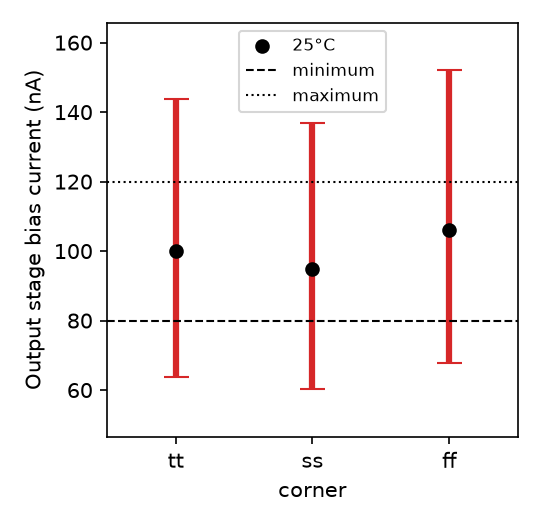

### current_consumption — plot

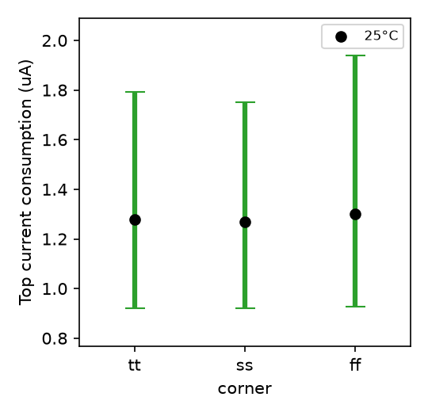

### psrr — plot

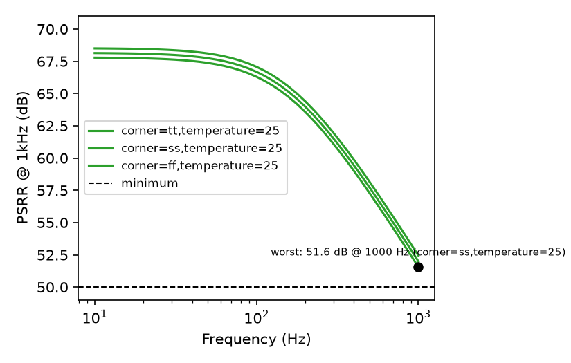

### stability — plot

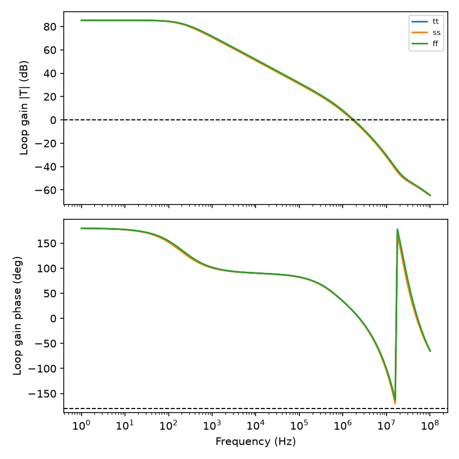

### standby_current — plot

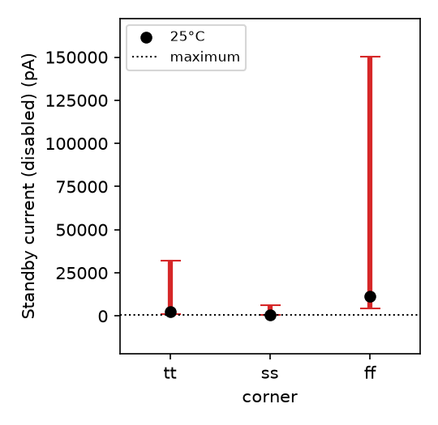

### startup — plot

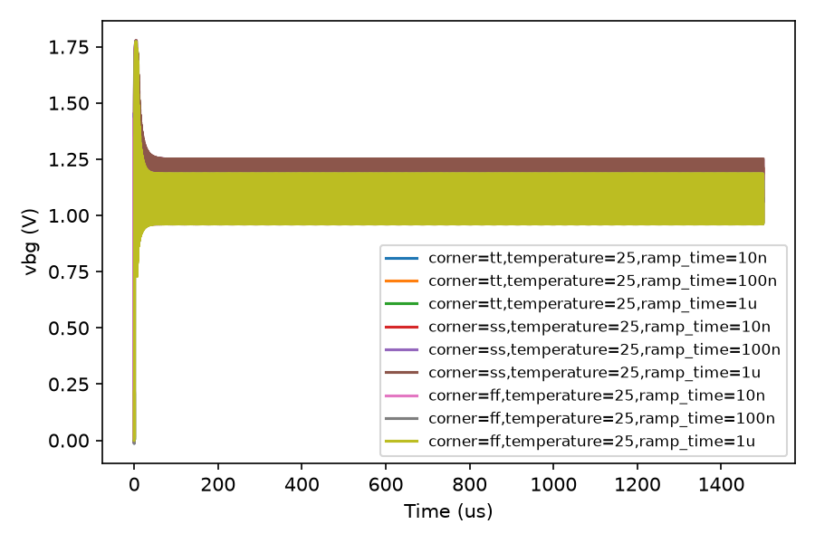

### temp_sweep — All

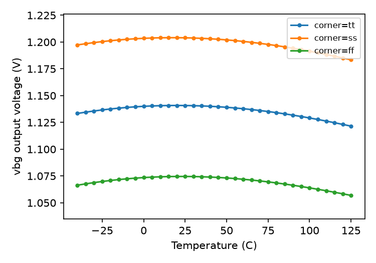

### temp_sweep — Typical

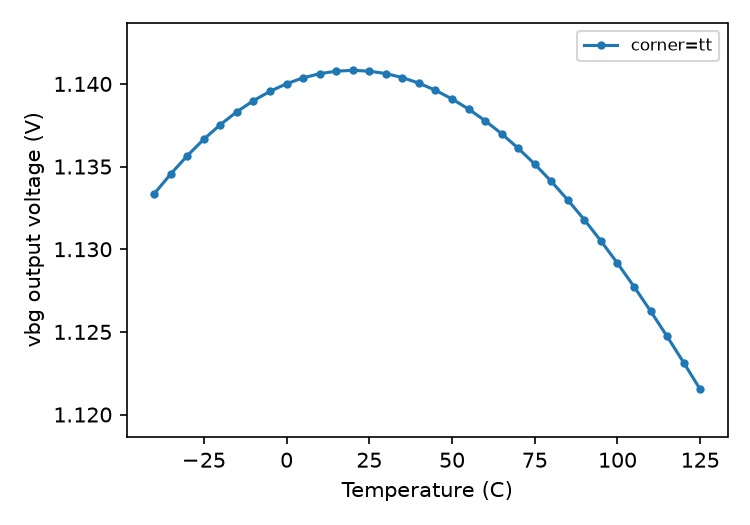

### temp_sweep — Worst

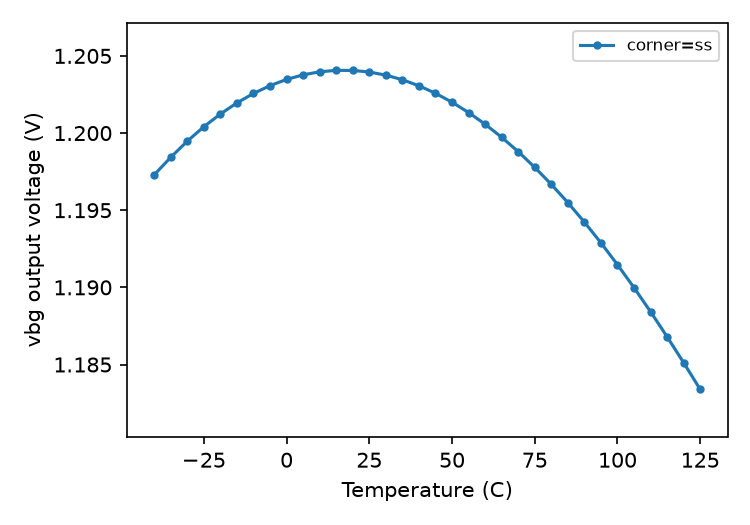

### trim_range — plot

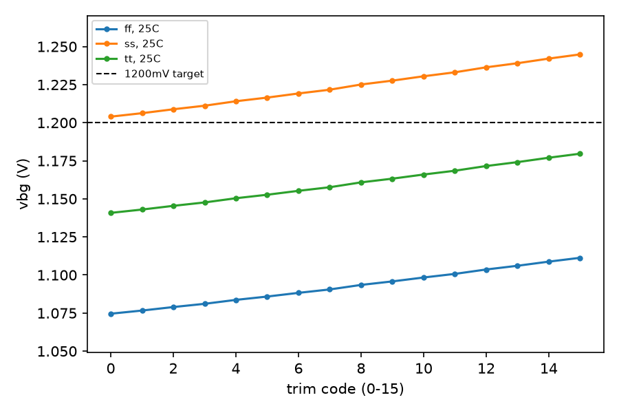

### vbg_mismatch — plot

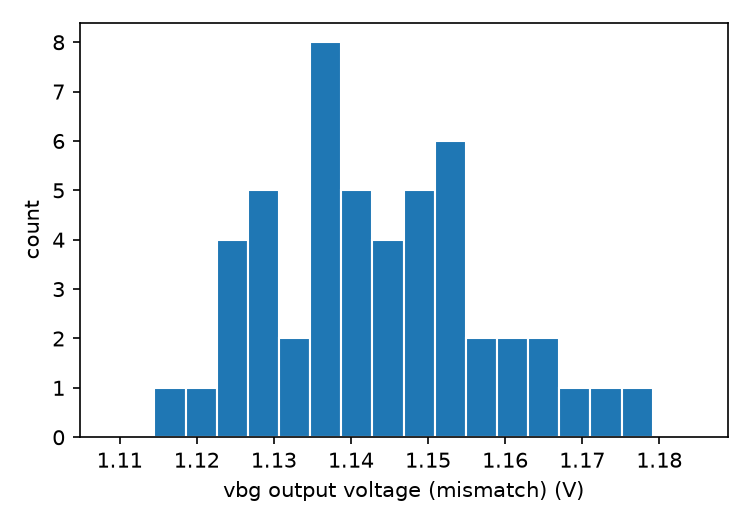

### vbg_stat — plot

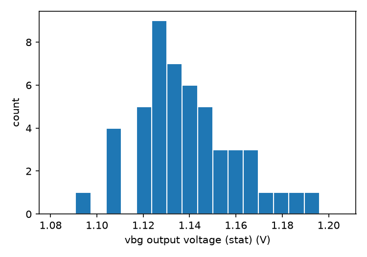
